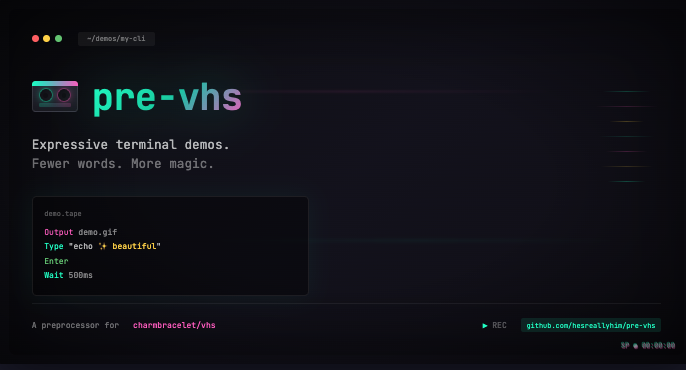

</sub>



A lightweight macro engine and DSL for writing VHS tapes faster, cleaner, and safer.

pre-vhs transforms a compact, expressive .tape.pre file into a valid VHS .tape.
It gives you a tiny language for automating common VHS patterns while staying 100% compatible with standard VHS syntax.

---

## Why?

VHS tapes are powerful but verbose.
Typing commands, fixing mistakes, waiting between steps—these become repetitive fast.

pre-vhs makes .tape authoring dramatically easier by adding:

- Macros (only `Type` is always on; everything else is opt-in)
- Header aliases for reusable patterns
- Positional arguments ($1, $2, …)
- Phase-based transforms (typing styles, doublers, gap insertion, etc.)
- Optional packs, opt-in via Use ...
- Absolutely no runtime dependency—output is plain VHS.

You still write VHS. You just write less of it.

---

## Basic Usage

1. Install

`npm install -D pre-vhs`

2. Write a .tape.pre

### header

```text
Use BackspaceAll Gap
TypeEnter = Type $1, Enter
```

### body

```text
> Gap 200ms
> Type $1, Enter
echo "hello"

> TypeEnter $1
echo "bye"
```

## 3. Build the tape

`npx pre-vhs demo # reads demo.tape.pre → writes demo.tape`

Or use stdin→stdout:

`cat demo.tape.pre | npx pre-vhs > demo.tape`

---

## Language Reference

1. Meta-directives (> lines)

A directive line:

```text
> CmdA, CmdB arg, CmdC
```

expands to a sequence of VHS commands.

If any command references $1, $2, … the next lines become its arguments:

```text
> Type $1, Enter
ls -la
```

produces:

```text
Type "ls -la"
Enter

Expansion model (quick reference):
- `$n` substitution happens before macro lookup.
- Inline args vs payload: if a header token has explicit text after the macro name, that text is treated as the payload; otherwise the payload comes from the consumed lines ($1 etc.).
- Macro outputs are treated as final VHS unless they name another macro; recursion is allowed with guards (depth/step limits, cycle detection).
```

---

## 2. Positional Arguments ($1..$n)

Each $n in a directive consumes one line beneath it:

```text
> Type $1, Enter, Type $2, Enter
echo "first"
echo "second"
```

---

## 3. Header Aliases

Aliases only appear at the top of the file before the first non-header line.

```text
TypeEnter = Type $1, Enter
Clear = BackspaceAll $1, Type "", Enter
```

Usage:

```text
> TypeEnter $1
whoami

> Clear $1
garbage
```

Aliases expand just like directives. They may reference built-ins or other aliases.

---

## 4. Built-ins & `Use`

Only `Type` is always available for correct escaping. All other helpers are opt-in via packs + `Use ...`.

Examples:

Macro Description
BackspaceAll Deletes entire payload text
BackspaceAllButOne Deletes payload except last char
Gap Inserts a timed Sleep between commands
TypeEnter (example alias pack) types payload + Enter
ClearLine (example alias) remove text + newline

To activate:

Use BackspaceAll BackspaceAllButOne Gap

---

## 5. Typing Styles (optional pack)

If you enable the typing-styles pack in pre-vhs.config.js:

module.exports = {
packs: [
"./packs/typingStyles.js"
]
};

…you can write:

```text
> SetTypingStyle human
> Type $1, Enter
echo "smoothly typed"
```

Human style breaks your text into chunks and emits randomized Type@xxms commands.

Another example:

```text
> SetTypingStyle sloppy
> Type $1
git commit -m "oops"
```

Sloppy style injects occasional mistakes and corrections for realism.

---

## 6. Transforms & Phases (advanced)

Packs can hook into multiple phases:

- `header`: rewrite header tokens before expansion (e.g., Type→HumanType).
- `preExpandToken`: per-token tweaks before macro lookup.
- `postExpand`: operate on emitted VHS lines (e.g., Gap inserts Sleep between commands, screenshot-after-every-command).
- `finalize`: last chance to rewrite the entire tape.
  Transform ordering: runs in registration order within a phase.

Example: Doubling every command (header phase):

```text
Use Doubler
```

Now:

```text
> Type $1, Enter
echo hi
```

becomes:

```text
Type "echo hi"
Type "echo hi"
Enter
Enter
```

Typing styles use the same mechanism.

---

## 7. Recursive Macros (advanced)

Macros can expand into other macro calls; the engine recurses with guards
(depth/step limits and cycle detection). This makes layered helpers like:

```text
TypeSleep = Type $1, Sleep 1s
EnterEcho = Enter, Type $1
RunAndEcho = TypeSleep $1, EnterEcho $2
```

work as expected without manual “with-gap” variants.

---

## 8. Importing Packs (Project-wide)

Optional packs may be enabled globally with a configuration file.

pre-vhs.config.js:

```js
module.exports = {
  packs: [
    "./packs/typingStyles.js",
    "./packs/gitBasics.js",
    "./packs/emojiShortcuts.js",
  ],
};
```

These behave like Vim plugins: they provide macros, but the user still chooses whether to activate them with Use ....

---

## Examples

Example: Git demo

Use Gap BackspaceAll

GitInit = Type "git init -q", Enter, Sleep 200ms
GitStatus = Type "git status", Enter

```text
> GitInit

> Type $1, Enter
git add .

> GitStatus
```

---

## Example: Complex one-liner

Use BackspaceAll Gap

```text
> Type $1, Sleep 200ms, Type $2, Enter, Gap 400ms, Type "Done", Enter
echo
"hello"
```

---

## CLI Options

pre-vhs <basename> # reads <basename>.tape.pre, outputs <basename>.tape
pre-vhs --config path
cat file | pre-vhs # stdin → stdout mode

---

## Testing

The test suite consists of:

- Golden file tests: .tape.pre → expected .tape
- Unit tests: header parsing, alias resolution, built-ins, error reporting
- Pack tests: typing styles, git, emoji shortcuts
- Lint/format hooks: `npm run lint`, `npm run format`, pre-commit runs lint-staged

---

## Design Principles

- Opt-in everything except Type
- No magic: preprocessing is visible, predictable, diff-able
- Tiny DSL: aliases and Use, not a programming language
- Composable: chain packs, transforms, macros
- Zero overhead: output is plain VHS

---

## Roadmap

- More built-in macro packs (filesystem, shortcuts, demos)
- Optional fenced JS header sections if needed
- Examples gallery / cookbook
- VS Code syntax highlighting for .tape.pre
- Playground website
