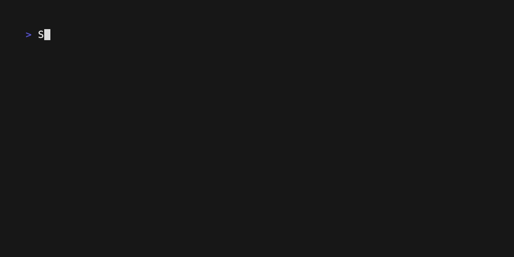
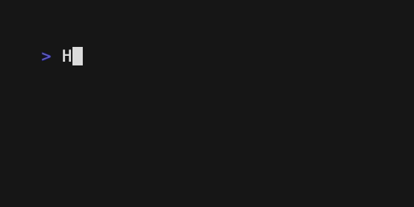

[](https://codecov.io/gh/hesreallyhim/pre-vhs)


A lightweight, adaptable Node.js preprocessor and macro engine for writing [@charmbracelet/VHS](https://github.com/charmbracelet/vhs) tapes with more complexity in fewer characters.

`pre-vhs` exposes a set of extensible syntactic conventions that you can easily adapt to your own workflow, potentially turning dozens of lines of repetitious VHS commands into a small handful of readable macros.

Additionally, `pre-vhs` unlocks functionality that is border-line unfeasible in the VHS syntax, such as advanced typing styles, and branching command sequences (conditionals). And what you get at the end is a perfectly valid VHS `.tape`.

---

## How to Get Started

1. Write a `.tape.pre` file. (See [Quickstart](#quickstart) instructions below.)
2. Convert it: `npx pre-vhs my-demo.tape.pre my-demo.tape`
3. Record it: `vhs my-demo.tape`

## Things You Can Do With `pre-vhs`

### 1. Take any sequence of commands and inline them for better readability.

**INSTEAD OF THIS**

```sh
Type 'echo "Hello"'
Enter
Sleep 1s
Type "ls"
Enter
Sleep 1s
```

**DO THIS**

```sh
# use the `>` symbol to
# express special directives

> Type $1, Enter, Sleep 1s
echo "Hello"

> Type $1, Enter, Sleep 1s
ls
```

### 2. Take any repeated sequence of commands and compress them into a macro.

**INSTEAD OF THIS**

```sh
Type 'echo "Hello"'
Enter
Sleep 1s
Type "ls"
Enter
Sleep 1s
```

**DO THIS**

```sh
# Define a macro
Run = Type $1, Enter, Sleep 1s

> Run $1
echo "Hello"

> Run $1
ls
```

**OR THIS**

```sh
Run = Type $1, Enter, Sleep 1s

> Run $1, Run $2
echo "Hello"
ls
```

`pre-vhs` syntax uses `$`-numbering to refer to the lines that immediately follow the directive.

### 3. Compose macros to express even more complex sequences in a more readable fashion.

**INSTEAD OF THIS**

```sh
Type 'echo "Hello"'
Enter
Sleep 1s
Screenshot
Sleep 1s
Type "ls"
Enter
Sleep 1s
```

**DO THIS**

```sh
Run = Type $1, Enter, Sleep 1s
Snap = Screenshot, Sleep 1s

> Run $1, Snap, Run $2
echo "Hello"
ls
```

**OR THIS**

```sh
Run = Type $1, Enter, Sleep 1s
Snap = Screenshot, Sleep 1s
RunSnap = Run $1, Snap

> RunSnap $1
echo "Hello"
```

## Packs

`pre-vhs` ships with a handful of first-party packs, but nothing is loaded by default.
Load a pack with `Pack` in the header, then activate its macros with `Use`.

### Convenient Builtins

- `Gap` — adds an automatic `Sleep` between directive tokens after you apply a gap value.

```sh
Pack builtins
> Apply Gap 200ms
> Type $1, Enter
echo "Hello"
> Type $1, Enter
ls
```

- `BackspaceAll` — deletes exactly the number of characters in the payload line.

```sh
Pack builtins
Use BackspaceAll

> Type $1
oops
> BackspaceAll $1
oops
> Type $1, Enter
echo "ok"
```

Other helpers in this pack include `BackspaceAllButOne`, `ClearLine`, `TypeEnter`,
`TypeAndEnter`, `WordGap`, `SentenceGap`, and `EachLine`.

If you get tired of writing `WordGap 200ms`, just alias it in the header:

```sh
MyWordGap = WordGap 200ms $1
```

`EachLine` maps a template over all `$*` lines:

```sh
Pack builtins
Use EachLine

> EachLine Type $1, Ctrl+C
line one
line two
```

### Typing Styles

- `Human` — naturalistic pacing with per-keystroke variation.

```sh
Pack builtins
Pack typingStyles
Use EachLine

TypeAndC = EachLine Type $1, Ctrl+C

Output demo.gif
Set Width 600
Set Height 300

> Apply TypingStyle human low 10

> TypeAndC $*
What if you could make a demo
and have it look like
a human was typing?

Sleep 1s

> Apply TypingStyle human low 10

Type "Well, now you can. :)"

Sleep 3s
```



- `Sloppy` — deliberately inserts and corrects typos for an imperfect feel.

```sh
Pack builtins
Pack typingStyles
Use EachLine

TypeAndC = EachLine Type $1, Ctrl+C

Output docs/tapes/sloppy-typing/sloppy-typing-demo.gif
Set Width 600
Set Height 300

> Apply TypingStyle sloppy high medium

> TypeAndC $*
Humans don't type like robots.
Sometimes we make mistakes.

Sleep 2s

> Apply TypingStyle sloppy high medium

Type "And sometimes..."
Ctrl+C
Type "We even do it on purpose. :)"

Sleep 3s
```



Typing styles also apply inside `EachLine` templates:

```sh
Pack typingStyles
Pack builtins
Use EachLine

> Apply TypingStyle human medium fast
> EachLine Type $1, Ctrl+C
Each word lands with a tiny pause.
The flow stays readable.
```

### Probe - Conditional Execution

Use `Probe` to run a shell command at preprocess time and branch based on its output.

```sh
Pack probe
Use Probe IfProbeMatched IfProbeNotMatched

> Probe /ready/ $1
curl -s http://localhost:8080/health

> IfProbeMatched $1
service is ready

> IfProbeNotMatched $1
service is NOT ready
```

## Packs & Local Modules

Load first-party packs by name, or load a local pack by path. Then `Use` the
macros you want to activate:

```sh
Pack builtins
Pack ./my-pack.js
Use MyMacro
```

Then set global modifiers inline where needed:

```sh
> Apply Gap 150ms
> Apply TypingStyle human low
```

## Customization

`pre-vhs` is designed to allow you to build any custom workflows that suit your needs.

Define macros in the header, compose them in directives, and build higher-level
commands that read like a script. For deeper customization, write a small pack
that registers your own macros or transforms and load it with `Pack`.

## Reference

For a complete reference guide, see [REFERENCE](./docs/REFERENCE.md).

---

## Quickstart

**1. Install**

```sh
npm i -g pre-vhs    # global
npm i -D pre-vhs    # or as dev dependency
npx pre-vhs ...     # or run it with npx
```

**2. Write a `.tape.pre` file**

A `.tape.pre` file consists of:

1. A header (this is where you load packs and define your own macros).

```sh
# header
Pack builtins
Pack ./my-pack.js  # load a local pack (path resolves from where you run pre-vhs)
Use BackspaceAll WordGap  # pre-vhs uses the "Use" syntax for imports
TypeEnter = Type $1, Enter  # A macro is a sequence of vhs commands
```

2. The body

```sh
Output my-demo.gif # Usual vhs frontmatter

> WordGap 200ms $1  # WordGap inserts a `sleep` in between each word.
echo "Hello and welcome to my demo"

> TypeEnter $1 # $-variables refer to the Nth line after the directives.
echo "bye"
```

After running it through `pre-vhs`:

```sh
# demo.tape
Output my-gemo.gif

Type `echo `
Sleep 200ms
Type `"Hello `
Sleep 200ms
Type `and `
Sleep 200ms
Type `welcome `
Sleep 200ms
Type `to `
Sleep 200ms
Type `my `
Sleep 200ms
Type `demo"`
Type `echo "bye"`
Enter
```

**3. Build the tape**

```sh
pre-vhs demo.tape.pre demo.tape
```

Or use the basename shorthand:

```sh
pre-vhs demo   # reads demo.tape.pre → writes demo.tape
```

Or pipe stdin→stdout:

```sh
cat demo.tape.pre | pre-vhs > demo.tape
```

---

[LICENSE](./docs/LICENSE)

MIT 2026 © Really Him
