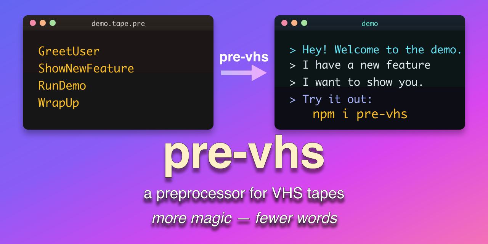

[](https://codecov.io/gh/hesreallyhim/pre-vhs)


A lightweight, adaptable Node.js preprocessor and macro engine for writing [@charmbracelet/VHS](https://github.com/charmbracelet/vhs) tapes with more complexity in fewer characters.

`pre-vhs` exposes a set of extensible syntactic conventions that you can easily adapt to your own workflow, potentially turning dozens of lines of repetitious VHS commands into a small handful of readable macros.

Additionally, `pre-vhs` unlocks functionality that is border-line unfeasible in the VHS syntax, such as advanced typing styles, and branching command sequences (conditionals). And what you get at the end is a perfectly valid VHS `.tape`.

---

## How to Get Started

1. Write a `.tape.pre` file. (See [Quickstart](#quickstart) instructions below.)
2. Convert it: `npx pre-vhs my-demo.tape.pre my-demo.tape`
3. Record it: `vhs my-demo.tape`

## Things You Can Do With `pre-vhs`

### 1. Take any sequence of commands and inline them for better readability.

**INSTEAD OF THIS**

```sh
Type 'echo "Hello"'
Enter
Sleep 1s
Type "ls"
Enter
Sleep 1s
```

**DO THIS**

```sh
# use the `>` symbol to
# express special directives

> Type $1, Enter, Sleep 1s
echo "Hello"

> Type $1, Enter, Sleep 1s
ls
```

### 2. Take any repeated sequence of commands and compress them into a macro.

**INSTEAD OF THIS**

```sh
Type 'echo "Hello"'
Enter
Sleep 1s
Type "ls"
Enter
Sleep 1s
```

**DO THIS**

```sh
# Define a macro
Run = Type $1, Enter, Sleep 1s

> Run $1
echo "Hello"

> Run $1
ls
```

**OR THIS**

```sh
Run = Type $1, Enter, Sleep 1s

> Run $1, Run $2
echo "Hello"
ls
```

`pre-vhs` syntax uses `$`-numbering to refer to the lines that immediately follow the directive.

### 3. Compose macros to express even more complex sequences in a more readable fashion.

**INSTEAD OF THIS**

```sh
Type 'echo "Hello"'
Enter
Sleep 1s
Screenshot
Sleep 1s
Type "ls"
Enter
Sleep 1s
```

**DO THIS**

```sh
Run = Type $1, Enter, Sleep 1s
Snap = Screenshot, Sleep 1s

> Run $1, Snap, Run $2
echo "Hello"
ls
```

**OR THIS**

```sh
Run = Type $1, Enter, Sleep 1s
Snap = Screenshot, Sleep 1s
RunSnap = Run $1, Snap

> RunSnap $1, Run $2
echo "Hello"
ls
```

## Packs

`pre-vhs` comes pre-loaded with a number of "packs" that provide powerful out-of-the-box functionality.

### Convenient Builtins

- `Gap` — adds an automatic `Sleep` between commands after you set a gap value.

```sh
Use Gap

> Gap 200ms
> Type $1, Enter
echo "Hello"
> Type $1, Enter
ls
```

- `BackspaceAll` — deletes exactly the number of characters in the payload line.

```sh
Use BackspaceAll

> Type $1
oops
> BackspaceAll $1
oops
> Type $1, Enter
echo "ok"
```

Other helpers in this pack include `BackspaceAllButOne`, `ClearLine`, and `TypeEnter`.

### Typing Styles

- `Human` — naturalistic pacing with per-keystroke variation.

```sh
Use SetTypingStyle Gap

> SetTypingStyle human high fast
> Gap 200ms
> Type $1, Enter
Shipping a demo should feel natural.
```


- `Sloppy` — deliberately inserts and corrects typos for an imperfect feel.

```sh
Use SetTypingStyle Gap

> SetTypingStyle sloppy high fast
> Gap 100ms
> Type $1, Enter
Sometimes typing is messy.
```


### Probe - Conditional Execution

Use `Probe` to run a shell command at preprocess time and branch based on its output.

```sh
Use Probe IfProbeMatched IfProbeNotMatched

> Probe /ready/ $1
curl -s http://localhost:8080/health

> IfProbeMatched $1
service is ready

> IfProbeNotMatched $1
service is NOT ready
```

## Configuration

- Configuration file

You can use a configuration file to load packs and set default values in `pre-vhs.config.js` (or pass `--config` to point elsewhere):

```js
module.exports = {
  packs: [
    "./src/packs/builtins.js",
    "./src/packs/typingStyles.js",
    "./src/packs/probe.js",
  ],
};
```

- In-script configuration

Or, you can activate macros per tape with `Use ...`, then set options inline:

```sh
Use Gap SetTypingStyle

> Gap 150ms
> SetTypingStyle human low
```

## Customization

`pre-vhs` is designed to allow you to build any custom workflows that suit your needs.

Define macros in the header, compose them in directives, and build higher-level
commands that read like a script. For deeper customization, write a small pack
that registers your own macros or transforms and load it via the config file.

## Reference

For a complete reference guide, including advanced configuration instructions, see [REFERENCE](./docs/REFERENCE.md).

---

## Quickstart

**1. Install**

```sh
npm i -g pre-vhs    # global
npm i -D pre-vhs    # or as dev dependency
npx pre-vhs ...     # or run it with npx
```

**2. Write a `.tape.pre` file**

A `.tape.pre` file consists of:

1. A header (this is where you import any pre-loaded macros or define your own).

```sh
# header
Use BackspaceAll Gap  # pre-vhs uses the "Use" syntax for imports
TypeEnter = Type $1, Sleep 2s  # A macro is a sequence of vhs commands
```

2. The body

```sh
Output my-demo.gif # Usual vhs frontmatter

> Gap 200ms  # "Gap" is a macro that inserts a `sleep` in between each word.
> Type $1, Sleep 2s  # pre-vhs commands are written as directives (`>`).
echo "Hello and welcome to my demo"

> TypeEnter $1 # $-variables refer to the Nth line after the directives.
echo "bye"
```

After running it through `pre-vhs`:

```sh
# demo.tape
Output my-gemo.gif

Type `echo "Hello"`
Sleep 200ms
Type `echo "and"`
Sleep 200ms
Type "`echo welcome"`
Sleep 200ms
Type `echo "to"`
Sleep 200ms
Type `echo "my"`
Sleep 200ms
Type `echo "demo"`
Enter
Sleep 2s
```

**3. Build the tape**

```sh
pre-vhs demo.tape.pre demo.tape
```

Or use the basename shorthand:

```sh
pre-vhs demo   # reads demo.tape.pre → writes demo.tape
```

Or pipe stdin→stdout:

```sh
cat demo.tape.pre | pre-vhs > demo.tape
```

---

[LICENSE](./docs/LICENSE)

MIT 2026 © Really Him
